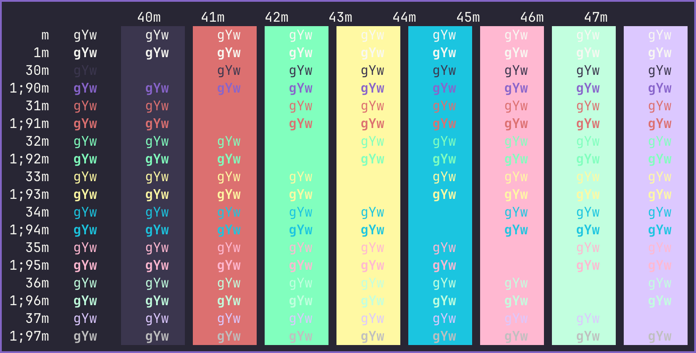

# Witch Hazel (Hypercolor) iTerm
Witch Hazel Hypercolor for iTerm2.

 

* [iTerm2 for macOS](https://iterm2.com/)

* [Witch Hazel color scheme](https://witchhazel.thea.codes/) 

*Witch Hazel Hypercolor.itermcolors*

 

